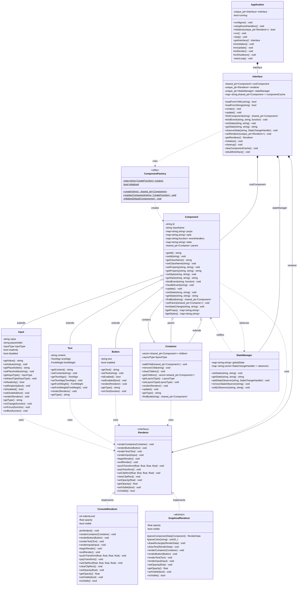

# Architecture

```mermaid
classDiagram
   class Renderer {
        <<interface>>
        +renderContainer(Container)* void
        +renderButton(Button)* void
        +renderText(Text)* void
        +renderInput(Input)* void
        +beginRender()* void
        +endRender()* void
        +pushTransform(float, float, float, float)* void
        +popTransform()* void
        +setClipRect(float, float, float, float)* void
        +clearClipRect()* void
        +setOpacity(float)* void
        +getOpacity()* float
        +setVisible(bool)* void
        +isVisible()* bool
    }

    class Component {
        -string id
        -string className
        -map~string,string~ props
        -map~string,string~ style
        -map~string,function~ eventHandlers
        -map~string,string~ state
        -shared_ptr~Container~ parent
        +getId() string
        +setId(string) void
        +getClassName() string
        +setClassName(string) void
        +setProperty(string, string) void
        +getProperty(string, string) string
        +setStyle(string, string) void
        +getStyle(string, string) string
        +bindEvent(string, function) void
        +handleEvent(string) void
        +update() void
        +setState(string, string) void
        +getState(string, string) string
        +findById(string) shared_ptr~Component~
        +setParent(shared_ptr~Container~) void
        #onStateChange(string, string) void
        #getProps() map~string,string~
        #getStyles() map~string,string~
    }

    class Container {
        -vector~shared_ptr~Component~~ children
        -LayoutType layoutType
        +addChild(shared_ptr~Component~) void
        +removeChild(string) void
        +clearChildren() void
        +getChildren() vector~shared_ptr~Component~~
        +getLayoutType() LayoutType
        +setLayoutType(LayoutType) void
        +render(Renderer) void
        +update() void
        +getType() string
        +findById(string) shared_ptr~Component~
    }

    class Button {
        -string text
        -bool enabled
        +getText() string
        +setText(string) void
        +isEnabled() bool
        +setEnabled(bool) void
        +render(Renderer) void
        +getType() string
        +onClick(function) void
    }

    class Text {
        -string content
        -TextAlign textAlign
        -FontWeight fontWeight
        +getContent() string
        +setContent(string) void
        +getTextAlign() TextAlign
        +setTextAlign(TextAlign) void
        +getFontWeight() FontWeight
        +setFontWeight(FontWeight) void
        +render(Renderer) void
        +getType() string
    }

    class Input {
        -string value
        -string placeholder
        -InputType inputType
        -bool readonly
        -bool disabled
        +getValue() string
        +setValue(string) void
        +getPlaceholder() string
        +setPlaceholder(string) void
        +getInputType() InputType
        +setInputType(InputType) void
        +isReadonly() bool
        +setReadonly(bool) void
        +isDisabled() bool
        +setDisabled(bool) void
        +render(Renderer) void
        +getType() string
        +onChange(function) void
        +onFocus(function) void
        +onBlur(function) void
    }

    class ConsoleRenderer {
        -int indentLevel
        -float opacity
        -bool visible
        -printIndent() void
        +renderContainer(Container) void
        +renderButton(Button) void
        +renderText(Text) void
        +renderInput(Input) void
        +beginRender() void
        +endRender() void
        +pushTransform(float, float, float, float) void
        +popTransform() void
        +setClipRect(float, float, float, float) void
        +clearClipRect() void
        +setOpacity(float) void
        +getOpacity() float
        +setVisible(bool) void
        +isVisible() bool
    }

    class GraphicalRenderer {
        <<abstract>>
        -float opacity
        -bool visible
        #parseComponentData(Component) RenderData
        #parseColor(string) uint32_t
        +drawRectangle(RenderData)* void
        +drawText(RenderData)* void
        +renderContainer(Container) void
        +renderButton(Button) void
        +renderText(Text) void
        +renderInput(Input) void
        +setOpacity(float) void
        +getOpacity() float
        +setVisible(bool) void
        +isVisible() bool
    }

    class ComponentFactory {
        <<utility>>
        -map~string,CreateFunction~ creators$
        -bool initialized$
        +create(string)$ shared_ptr~Component~
        +registerComponent(string, CreateFunction)$ void
        -initializeDefaultComponents()$ void
    }

    class StateManager {
        -map~string,string~ globalState
        -map~string,vector~StateChangeHandler~~ observers
        +setState(string, string) void
        +getState(string, string) string
        +addStateObserver(string, StateChangeHandler) void
        +removeStateObserver(string) void
        -notifyObservers(string, string) void
    }

    class Interface {
        -shared_ptr~Component~ rootComponent
        -unique_ptr~Renderer~ renderer
        -unique_ptr~StateManager~ stateManager
        -map~string,shared_ptr~Component~~ componentCache
        +loadFromYAML(string) bool
        +loadFromString(string) bool
        +render() void
        +update() void
        +findComponent(string) shared_ptr~Component~
        +bindEvent(string, string, function) void
        +setState(string, string) void
        +getState(string, string) string
        +observeState(string, StateChangeHandler) void
        +setRenderer(unique_ptr~Renderer~) void
        +getRenderer() Renderer*
        +initialize() void
        +cleanup() void
        -clearComponentCache() void
        -rebuildInterface() void
    }

    class Application {
        -unique_ptr~Interface~ interface
        -bool running
        +configure() void
        +setupEventHandlers() void
        +initialize(unique_ptr~Renderer~) bool
        +run() void
        +stop() void
        +getInterface() Interface*
        #onInitialize() void
        #onUpdate() void
        #onRender() void
        #onShutdown() void
        -mainLoop() void
    }

    Component <|-- Container : extends
    Component <|-- Button : extends
    Component <|-- Text : extends
    Component <|-- Input : extends

    Renderer <|.. ConsoleRenderer : implements
    Renderer <|.. GraphicalRenderer : implements

    Container o-- Component : contains
    Component o-- Container : parent

    Interface *-- Component : rootComponent
    Interface *-- Renderer : renderer
    Interface *-- StateManager : stateManager

    Application *-- Interface : interface

    Component ..> Renderer : uses
    Container ..> Renderer : uses
    Button ..> Renderer : uses
    Text ..> Renderer : uses
    Input ..> Renderer : uses

    ComponentFactory ..> Component : creates

    Interface ..> ComponentFactory : uses

    StateManager ..> Component : notifies
    Component ..> StateManager : observes
```
